----------------------------------------------

最新版作业

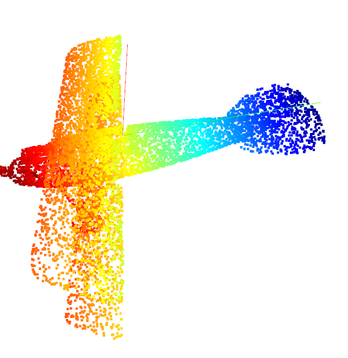

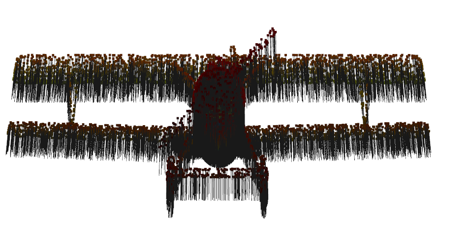

random

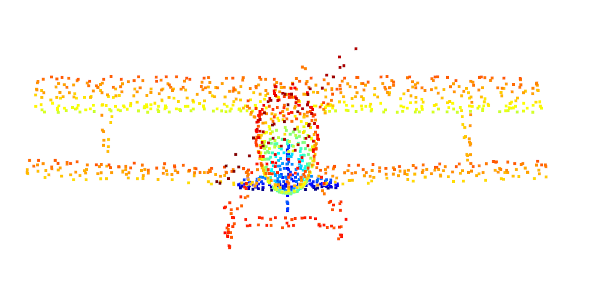

centroid

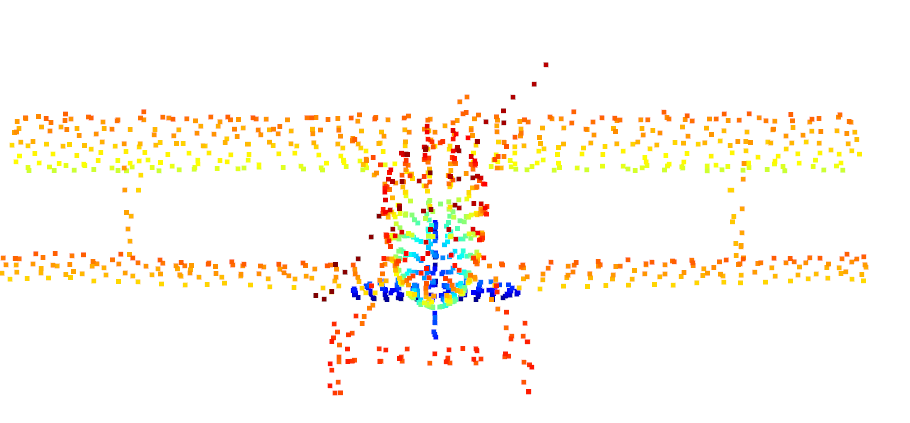

hashtable

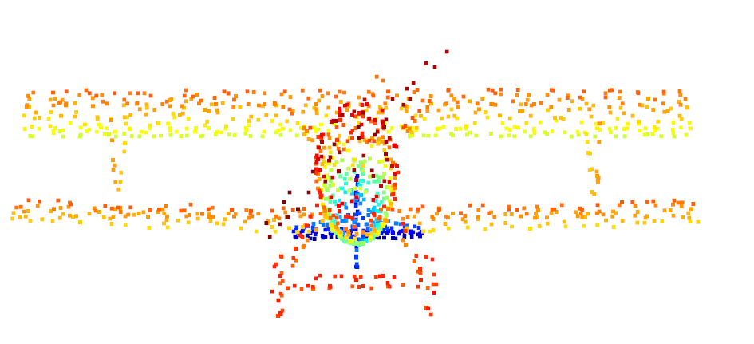

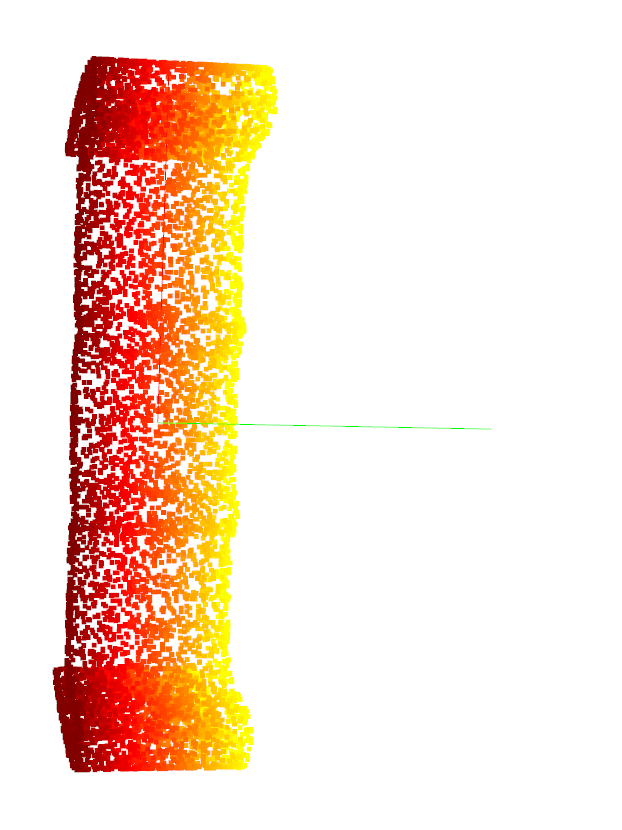

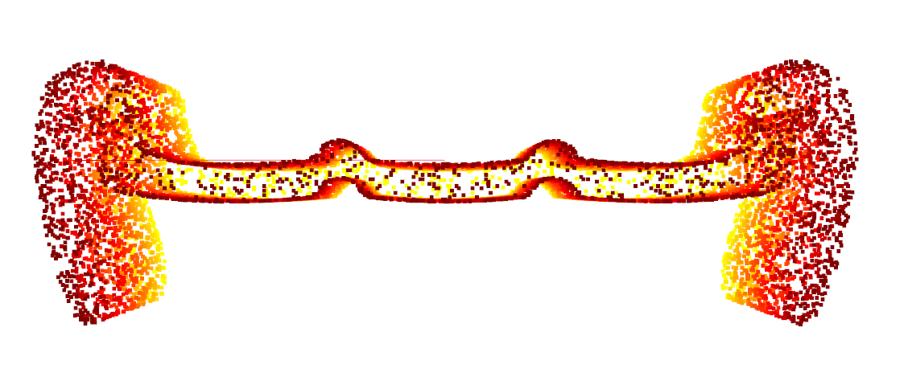

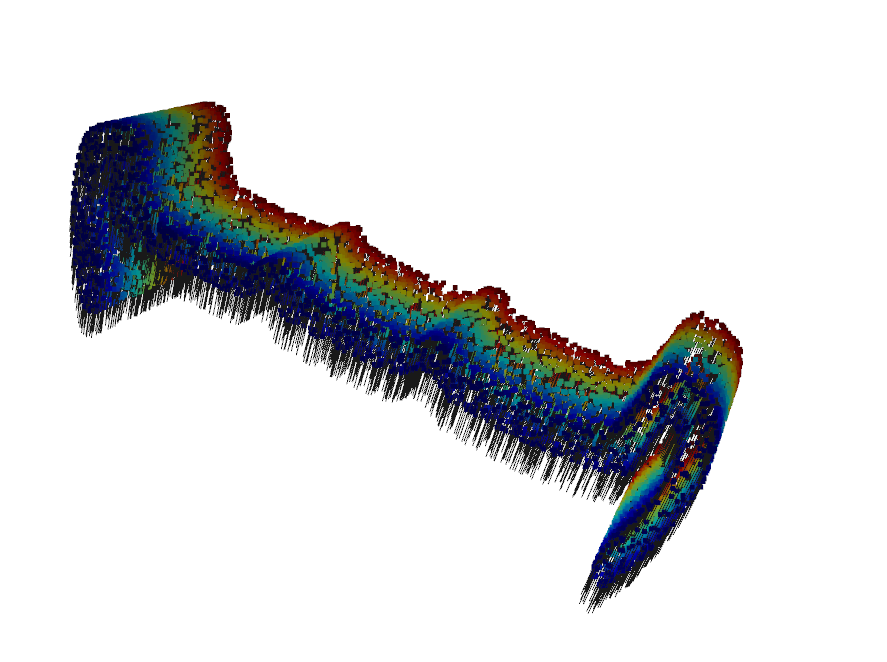

random 

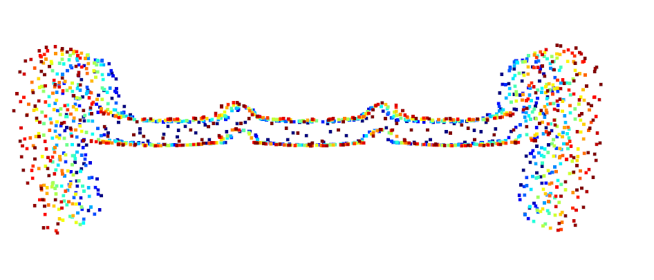

centroid

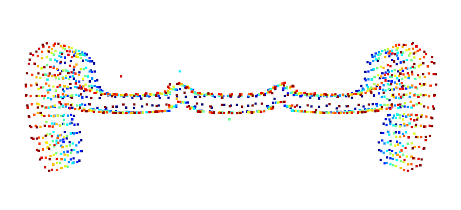

hashtable

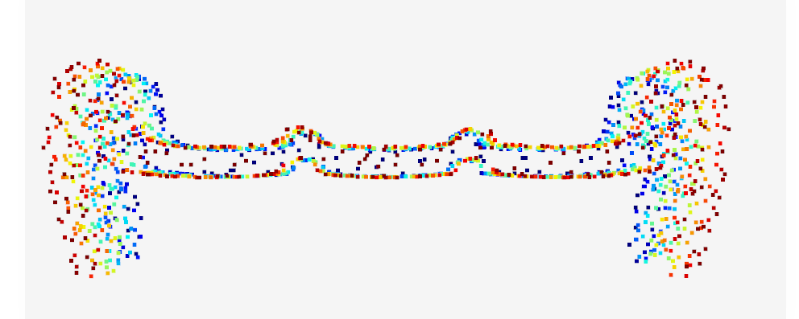

--------------------------------------------------------------------------

--------------------------------------------------------------------------

--------------------------------------------------------------------------

第一版作业

/home/yhzhao/dataset/3D/3d_pcl/modelnet40_normal_resampled_ply/airplane/airplane_0001.ply

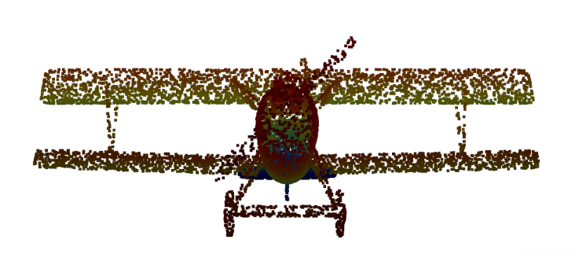

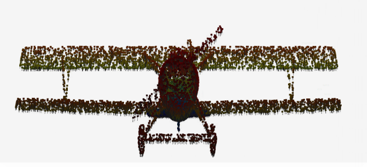

以0.05米作为分辨率

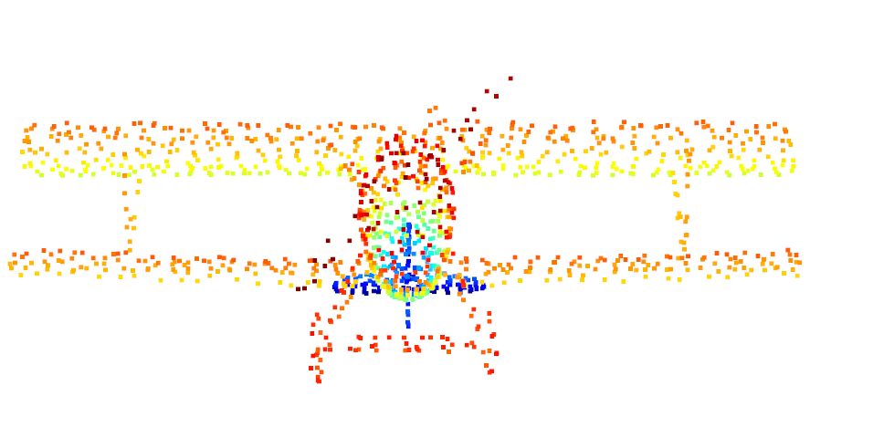

/home/yhzhao/dataset/3D/3d_pcl/modelnet40_normal_resampled_ply/bench/bench_0001.ply

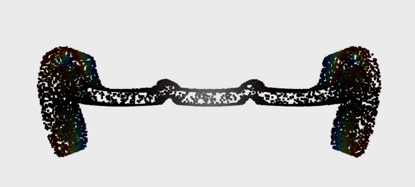

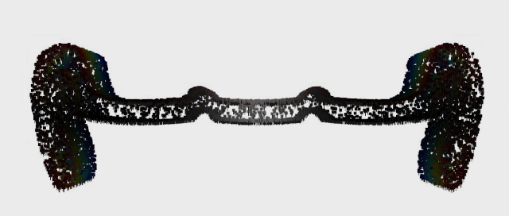

以0.05米作为分辨率

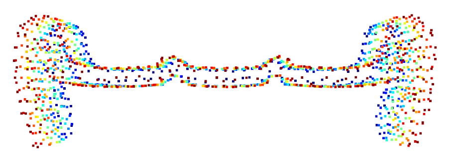

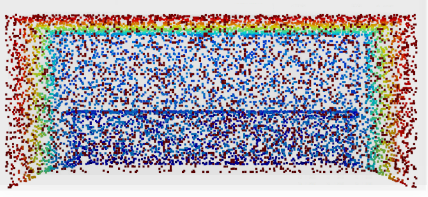

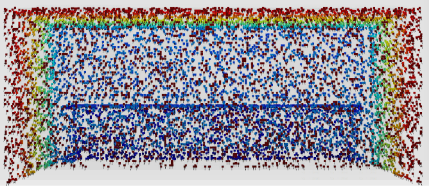

以0.05米作为分辨率

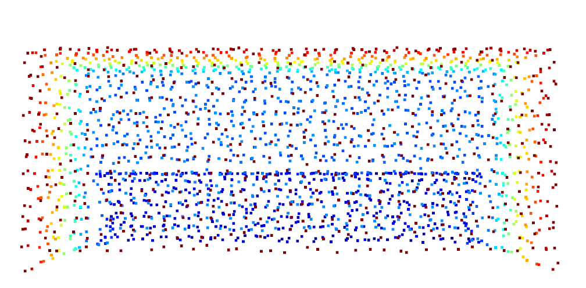

